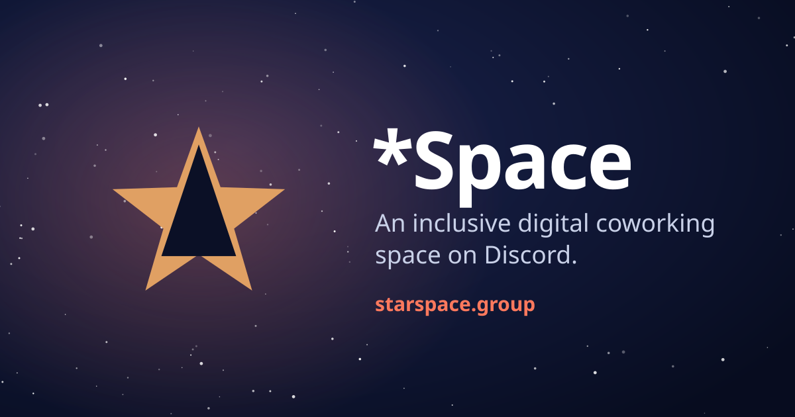

[](https://github.com/starspacegroup/starspace-group-nebulakit)

# *Space

*Space is a cosmic-grade SvelteKit starter template powered by Cloudflare's full stack.
Publishing structured content, managing authenticated users, operating AI-assisted workflows,
and observing the app without third-party analytics are all wired up and tested before you
write a line. It runs on Cloudflare Pages with D1, KV, and R2 bindings.

**Click "Use this template"** to create your own repository, then follow
[CUSTOMIZE.md](./CUSTOMIZE.md) — one script renames the app, the slug, the dev port, and the
Cloudflare resource names, and tells you what is left to do by hand.

[](https://svelte.dev/docs/kit)
[](https://developers.cloudflare.com/pages/)
[](./CONTRIBUTING.md#coverage-requirements)

## What ships

- **Content operations:** typed CMS schemas, rich-text embeds, tags, media uploads, public
  content routes, and guarded admin editing.
- **Authentication:** email/password accounts plus GitHub and Discord OAuth, account linking,
  session cookies, owner bootstrap, and per-user admin permissions.
- **AI workspace:** configurable provider keys, streaming chat, conversation history, model
  selection, and optional realtime voice sessions.
- **Private administration:** users, auth credentials, AI keys, contact submissions, CMS,
  privacy-safe PII reveal controls, and first-party analytics.
- **Agent-ready publishing:** `robots.txt`, dynamic sitemap, RFC 9727 API catalog, Agent Skills
  discovery, `/auth.md`, HTML-to-Markdown negotiation, and read-only WebMCP tools.
- **Accessible shell:** command palette, responsive navigation, light/dark themes, complete PWA
  install metadata, automated WCAG AA contrast checks, and a widget board whose every pointer
  gesture has a keyboard equivalent.

*Space does **not** advertise an OAuth authorization server or an MCP server. Its discovery
metadata lists only routes implemented by this repository — keep that honest in your own app.

Planned additions — including capabilities already proven in *Space-derived projects — are tracked in [ROADMAP.md](./ROADMAP.md).

## Requirements

- [Bun](https://bun.sh/) 1.3.14 or newer
- A Cloudflare account with Pages, D1, KV, and R2 access for remote deployment
- Node.js 22 or newer when running the Node-based utility scripts

The repository deliberately contains placeholder D1/KV identifiers. Builds fail until real,
project-owned resources are configured; this prevents accidental access to another deployment's
data.

## Make it yours

```bash
bun run customize          # interactive rename: name, slug, dev port, repo, URL
bun run customize --dry    # preview every file it would touch, writes nothing
```

The full ordered path — including the parts a script cannot do — is
[CUSTOMIZE.md](./CUSTOMIZE.md). Track whether it is finished in
[INITIAL_CUSTOMIZATION_STATUS.md](./INITIAL_CUSTOMIZATION_STATUS.md).

## Local development

```bash
bun install --frozen-lockfile
bun run db:migrate:local
bun run dev
```

Open <http://localhost:4203>. Local migrations use Wrangler's local state and do not require
production Cloudflare identifiers.

Useful commands:

```bash
bun run check              # Svelte/TypeScript diagnostics
bun run test               # unit and integration tests
bun run test:coverage      # enforced 95% floor on all four metrics
bun run validate:contrast  # WCAG AA theme contrast
bun run test:e2e           # local D1 migration + Playwright suite
bun run validate:all       # check + tests + contrast
```

The authoritative contribution and test workflow is in [CONTRIBUTING.md](./CONTRIBUTING.md).

## Cloudflare setup

Authenticate Wrangler, select the intended Cloudflare account, then create *Space-owned
resources:

```bash
bunx wrangler login
bun run setup:cf --dry-run
bun run setup:cf
bunx wrangler r2 bucket create starspace-group-files
bun run db:migrate
```

`bun run setup:cf` creates the D1 database and separate production/preview KV namespaces, writes
their identifiers to `wrangler.toml`, and runs the binding guard. If more than one account is
available, set `CLOUDFLARE_ACCOUNT_ID` explicitly before running it.

Never reuse resource IDs from another project. Never set the KV preview namespace equal to the
production namespace. See [docs/CLOUDFLARE_SETUP.md](./docs/CLOUDFLARE_SETUP.md) for the complete
procedure and failure recovery.

After the resources exist:

```bash
bun run build
bun run deploy
```

Secrets belong in Cloudflare Pages settings or Wrangler secrets, never in Git. Start with
[.env.example](./.env.example) for local configuration. Authentication requires separate,
high-entropy `SESSION_SECRET` and `SETUP_SECRET` values; generate each independently before using
`/setup`.

## Application workflow

1. Run the local or remote D1 migrations.
2. Set `SESSION_SECRET` and `SETUP_SECRET`, then open `/setup` with the bootstrap secret to configure
   owner identity and authentication credentials.
3. Sign in through `/auth/login` or create a password account through `/auth/signup`.
4. Configure AI providers under `/admin/ai-keys` if chat is required.
5. Create content types and entries under `/admin/cms`.
6. Review privacy-safe usage data at `/admin/stats` when the account has `can_view_stats`.

The in-application guide at `/documentation` is the canonical user/operator walkthrough and must
change in the same commit as any user-visible feature.

## Architecture

```text
src/
├── lib/
│   ├── cms/          # schemas, registry, embeds, uploads
│   ├── components/   # application and admin UI
│   ├── server/       # request-bound server helpers
│   ├── services/     # CMS, contact, account merge, AI clients
│   └── utils/        # sessions, auth state, analytics, validation
└── routes/
    ├── admin/        # protected operator surfaces
    ├── api/          # auth, CMS, chat, stats, setup, uploads
    ├── chat/         # authenticated AI workspace
    └── documentation/# shipped operator documentation

migrations/           # immutable ordered D1 migrations
scripts/              # binding, migration, setup, palette, tunnel tools
static/               # icons and social assets
tests/                # unit, integration, fixtures, and E2E
```

Important boundaries:

- Existing migration files are immutable once committed to `main`; add a new numbered migration.
- Colors come from CSS variables in `src/app.css`; do not add hardcoded theme colors.
- Tests must never use a real user store or production Cloudflare resource.
- Discovery metadata must not claim routes or protocols the application does not implement.

## Documentation

- [Customizing a new app](./CUSTOMIZE.md) and its [deep reference](./docs/INITIAL_CUSTOMIZATION.md)
- [Local setup](./docs/LOCAL_SETUP.md)
- [Cloudflare setup](./docs/CLOUDFLARE_SETUP.md)
- [Agent readiness](./docs/AGENT_READINESS.md)
- [CMS embeds](./docs/CMS_EMBEDS.md)
- [Admin analytics](./docs/ADMIN_STATS.md)
- [Theme system](./docs/THEME_SYSTEM.md)
- [Command palette](./docs/COMMAND_PALETTE.md)
- [TDD workflow](./docs/TDD_WORKFLOW.md)
- [In-app documentation contract](./docs/DOCUMENTATION_PAGE.md)

## Contributing

Use Conventional Commits, write behavior tests first, keep all coverage metrics at or above 95%,
and run the full relevant gates before opening a pull request. See
[CONTRIBUTING.md](./CONTRIBUTING.md).

## License

MIT. See [LICENSE](./LICENSE).
